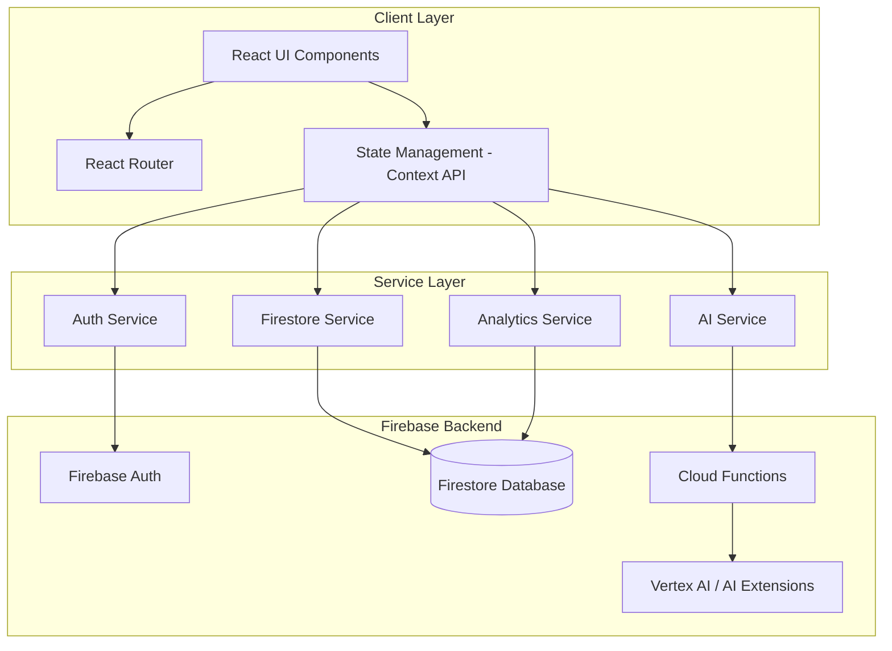

# Design Document: aMAZE-AI

## Overview

aMAZE AI is a modern web application built with React, TypeScript, and Firebase that serves two distinct user personas: Content Creators and Content Consumers. The platform leverages Firebase's Vertex AI integration (or Firebase Extensions for AI) to provide intelligent content generation, personalization, and reflection capabilities.

The architecture follows a component-based design with clear separation between presentation, business logic, and data access layers. The application uses Firebase Authentication for user management, Firestore for data persistence, and integrates with generative AI APIs for content intelligence features.

### Key Design Principles

1. **Role-Based Experience**: Separate dashboards and feature sets for Creators vs Consumers
2. **AI-First**: Generative AI integrated throughout the user journey
3. **Real-time Sync**: Firestore real-time listeners for instant data updates
4. **Mobile-First**: Responsive design optimized for mobile devices
5. **Performance**: Code splitting, lazy loading, and optimized bundle sizes
6. **Accessibility**: WCAG-compliant UI components

## Architecture

### High-Level Architecture



### Technology Stack

**Frontend:**
- React 18+ with TypeScript
- Vite for build tooling and dev server
- React Router v6 for routing
- Tailwind CSS for styling
- Framer Motion for animations
- React Hook Form for form management
- Date-fns for date manipulation

Backend Infrastructure:

Amazon Web Services Cognito
(User Authentication – Email/Password, Google OAuth)

Amazon Web Services DynamoDB
(Scalable NoSQL database for users, content, analytics)

Amazon Web Services Lambda
(Serverless backend logic and AI orchestration)

Amazon Web Services API Gateway
(Secure API exposure for frontend communication)

Amazon Web Services S3
(Static site hosting & media storage)

Amazon Web Services CloudFront
(Global CDN for fast content delivery)

AI Integration (AWS-Native)

Amazon Web Services Bedrock
→ Generative AI for:

Content idea generation

Caption & script creation

Summarization

Personalized recommendations

Custom prompt engineering layer inside Lambda

Streaming responses enabled via API Gateway + Lambda integration

Scalable serverless AI processing architecture
### Project Structure

```
aMAZE-ai/
aMAZE-ai/
├── src/
│   ├── components/
│   │   ├── common/              # Shared UI components
│   │   ├── auth/                # Cognito authentication components
│   │   ├── creator/             # Creator-specific components
│   │   ├── consumer/            # Consumer-specific components
│   │   ├── admin/               # Admin panel components
│   │   └── layout/              # Layout components (Header, Sidebar, etc.)
│   ├── pages/
│   │   ├── AuthPage.tsx
│   │   ├── OnboardingPage.tsx
│   │   ├── CreatorDashboard.tsx
│   │   ├── ConsumerDashboard.tsx
│   │   └── AdminPanel.tsx
│   ├── services/
│   │   ├── auth.service.ts          # Amazon Cognito integration
│   │   ├── database.service.ts      # DynamoDB operations
│   │   ├── ai.service.ts            # Bedrock / AI API calls
│   │   └── analytics.service.ts     # Analytics processing
│   ├── hooks/
│   │   ├── useAuth.ts               # Cognito auth hook
│   │   ├── useDatabase.ts           # DynamoDB hook
│   │   ├── useAI.ts                 # AI interaction hook
│   │   └── useTheme.ts
│   ├── contexts/
│   │   ├── AuthContext.tsx
│   │   ├── ThemeContext.tsx
│   │   └── UserContext.tsx
│   ├── types/
│   │   ├── user.types.ts
│   │   ├── content.types.ts
│   │   └── analytics.types.ts
│   ├── utils/
│   │   ├── validators.ts
│   │   ├── formatters.ts
│   │   └── constants.ts
│   ├── config/
│   │   └── aws.config.ts           # AWS SDK configuration
│   ├── App.tsx
│   └── main.tsx
│
├── backend/
│   ├── lambda/                     # AWS Lambda functions
│   │   ├── ai/
│   │   │   ├── generateIdeas.ts
│   │   │   ├── generateReflection.ts
│   │   │   ├── chatAssistant.ts
│   │   │   └── recommendations.ts
│   │   └── index.ts
│   └── package.json
│
├── infrastructure/                  # IAM policies & deployment configs
│
└── package.json


## Components and Interfaces

### Core Type Definitions

```typescript
// User Types
interface User {
  uid: string;
  email: string;
  displayName: string;
  photoURL?: string;
  role: 'creator' | 'consumer' | 'admin';
  interests?: string[];
  niche?: string;
  targetAudience?: string;
  themePreference: 'light' | 'dark';
  createdAt: Timestamp;
  updatedAt: Timestamp;
}

// Content Idea Types
interface ContentIdea {
  id: string;
  userId: string;
  type: 'short-form' | 'long-form' | 'carousel' | 'post';
  title: string;
  hook: string;
  caption: string;
  description: string;
  niche: string;
  trending: boolean;
  saved: boolean;
  createdAt: Timestamp;
}

// Vision Board Types
interface VisionBoard {
  id: string;
  userId: string;
  goals: Goal[];
  inspirationImages: string[];
  motivationalNotes: Note[];
  createdAt: Timestamp;
  updatedAt: Timestamp;
}

interface Goal {
  id: string;
  type: 'subscribers' | 'brand-deals' | 'posting-frequency' | 'learning' | 'skill';
  title: string;
  target: number;
  current: number;
  deadline?: Timestamp;
  completed: boolean;
}

interface Note {
  id: string;
  content: string;
  createdAt: Timestamp;
}

// Schedule Types
interface Schedule {
  id: string;
  userId: string;
  contentItems: ContentItem[];
  weekStartDate: Timestamp;
  consistencyScore: number;
}

interface ContentItem {
  id: string;
  title: string;
  type: string;
  plannedDate: Timestamp;
  status: 'planned' | 'posted';
  postedDate?: Timestamp;
}

// Reflection Types
interface Reflection {
  id: string;
  userId: string;
  contentTitle: string;
  contentUrl?: string;
  userSummary: string;
  aiSummary: string;
  actionSteps: string[];
  discussionPrompts: string[];
  createdAt: Timestamp;
}

// Analytics Types
interface CreatorAnalytics {
  userId: string;
  weeklyProductivityScore: number;
  contentCreationStreak: number;
  goalCompletionPercentage: number;
  totalContentPlanned: number;
  totalContentPosted: number;
  lastUpdated: Timestamp;
}

interface ConsumerAnalytics {
  userId: string;
  totalTimeSpent: number;
  productiveTime: number;
  nonProductiveTime: number;
  weeklyReport: WeeklyReport;
  lastUpdated: Timestamp;
}

interface WeeklyReport {
  weekStartDate: Timestamp;
  totalTime: number;
  productivePercentage: number;
  topCategories: string[];
}

// AI Request/Response Types
interface IdeaGenerationRequest {
  niche: string;
  interests: string[];
  targetAudience: string;
  contentType?: 'short-form' | 'long-form' | 'carousel' | 'all';
}

interface IdeaGenerationResponse {
  ideas: ContentIdea[];
}

interface ReflectionRequest {
  contentTitle: string;
  userSummary: string;
  contentUrl?: string;
}

interface ReflectionResponse {
  aiSummary: string;
  actionSteps: string[];
  discussionPrompts: string[];
}

interface ChatMessage {
  role: 'user' | 'assistant';
  content: string;
  timestamp: Timestamp;
}
```

### Service Layer Interfaces

// Auth Service (Amazon Cognito)
interface IAuthService {
  signInWithGoogle(): Promise<User>;
  signInWithEmail(email: string, password: string): Promise<User>;
  signUpWithEmail(email: string, password: string, displayName: string): Promise<User>;
  signOut(): Promise<void>;
  getCurrentUser(): User | null;
  onAuthStateChanged(callback: (user: User | null) => void): () => void;
}

// Database Service (Amazon DynamoDB)
interface IDatabaseService {
  // User operations
  createUser(user: User): Promise<void>;
  getUser(uid: string): Promise<User | null>;
  updateUser(uid: string, data: Partial<User>): Promise<void>;
  
  // Content Ideas operations
  saveContentIdea(idea: ContentIdea): Promise<string>;
  getContentIdeas(userId: string): Promise<ContentIdea[]>;
  deleteContentIdea(ideaId: string): Promise<void>;
  
  // Vision Board operations
  createVisionBoard(visionBoard: VisionBoard): Promise<string>;
  getVisionBoard(userId: string): Promise<VisionBoard | null>;
  updateVisionBoard(id: string, data: Partial<VisionBoard>): Promise<void>;
  
  // Schedule operations
  createSchedule(schedule: Schedule): Promise<string>;
  getSchedule(userId: string, weekStartDate: Date): Promise<Schedule | null>;
  updateSchedule(id: string, data: Partial<Schedule>): Promise<void>;
  
  // Reflection operations
  saveReflection(reflection: Reflection): Promise<string>;
  getReflections(userId: string): Promise<Reflection[]>;
  
  // Analytics operations
  getCreatorAnalytics(userId: string): Promise<CreatorAnalytics | null>;
  updateCreatorAnalytics(userId: string, data: Partial<CreatorAnalytics>): Promise<void>;
  getConsumerAnalytics(userId: string): Promise<ConsumerAnalytics | null>;
  updateConsumerAnalytics(userId: string, data: Partial<ConsumerAnalytics>): Promise<void>;
  
  // Admin operations
  getAllCreatorAnalytics(): Promise<CreatorAnalytics[]>;
  getAllConsumerAnalytics(): Promise<ConsumerAnalytics[]>;
}

// AI Service (AWS Bedrock via Lambda)
interface IAIService {
  generateContentIdeas(request: IdeaGenerationRequest): Promise<IdeaGenerationResponse>;
  generateReflection(request: ReflectionRequest): Promise<ReflectionResponse>;
  chatWithAssistant(messages: ChatMessage[], context?: string): Promise<string>;
  getTrendingTopics(niche?: string): Promise<string[]>;
  generateRecommendations(userId: string, watchHistory: string[], savedContent: string[]): Promise<string[]>;
}

// Analytics Service
interface IAnalyticsService {
  calculateProductivityScore(userId: string): Promise<number>;
  calculateConsistencyScore(schedule: Schedule): number;
  calculateGoalCompletion(goals: Goal[]): number;
  trackContentConsumption(userId: string, duration: number, isProductive: boolean): Promise<void>;
  generateWeeklyReport(userId: string): Promise<WeeklyReport>;
}


### Key React Components

```typescript
// Authentication Components
interface AuthPageProps {}
interface LoginFormProps {
  onSuccess: () => void;
}
interface SignupFormProps {
  onSuccess: () => void;
}

// Onboarding Components
interface OnboardingPageProps {}
interface RoleSelectorProps {
  onRoleSelect: (role: 'creator' | 'consumer') => void;
}

// Creator Components
interface CreatorDashboardProps {}
interface IdeaGeneratorProps {
  userId: string;
}
interface TrendingTopicsProps {
  niche?: string;
}
interface VisionBoardProps {
  userId: string;
}
interface ContentPlannerProps {
  userId: string;
}
interface CreatorAnalyticsProps {
  userId: string;
}

// Consumer Components
interface ConsumerDashboardProps {}
interface ContentFeedProps {
  userId: string;
}
interface ReflectionAssistantProps {
  userId: string;
  contentTitle: string;
}
interface ChatInterfaceProps {
  userId: string;
  context?: string;
}
interface ConsumerAnalyticsProps {
  userId: string;
}
interface ConsumerVisionBoardProps {
  userId: string;
}

// Common Components
interface ButtonProps {
  variant: 'primary' | 'secondary' | 'outline';
  size: 'sm' | 'md' | 'lg';
  onClick: () => void;
  children: React.ReactNode;
  disabled?: boolean;
  loading?: boolean;
}

interface CardProps {
  title?: string;
  children: React.ReactNode;
  className?: string;
  animated?: boolean;
}

interface ModalProps {
  isOpen: boolean;
  onClose: () => void;
  title: string;
  children: React.ReactNode;
}

interface ThemeToggleProps {
  theme: 'light' | 'dark';
  onToggle: () => void;
}
```

## Data Models

Users Table

Table Name: Users
Partition Key: userId (String)

Attributes:

- email: string
- displayName: string
- photoURL: string
- role: 'creator' | 'consumer' | 'admin'
- interests: string[]
- niche: string
- targetAudience: string
- themePreference: 'light' | 'dark'
- createdAt: number (timestamp)
- updatedAt: number (timestamp)

ContentIdeas Table

Table Name: ContentIdeas
Partition Key: ideaId (String)
GSI: userId-index

- ideaId: string
- userId: string
- type: 'short-form' | 'long-form' | 'carousel' | 'post'
- title: string
- hook: string
- caption: string
- description: string
- niche: string
- trending: boolean
- saved: boolean
- createdAt: number

VisionBoards Table

Partition Key: boardId
GSI: userId-index

Schedules Table

Partition Key: scheduleId
GSI: userId-weekStartDate-index

Reflections Table

Partition Key: reflectionId
GSI: userId-index

Analytics Table (Single Table Design Recommended)

Partition Key: userId
Sort Key: type (creator | consumer)

ChatHistory Table

Partition Key: userId
Sort Key: sessionId

- messages: ChatMessage[]
- context: string
- createdAt: number

🔒 Access Control (Replacing Firestore Security Rules)

Instead of Firestore rules, we use:

Amazon Web Services Cognito for authentication

Amazon Web Services IAM Roles & Policies for authorization

API validation inside Amazon Web Services Lambda

Access Logic:

Users can only access their own data

Admin role verified via Cognito JWT claims

Role-based access enforced inside Lambda

Fine-grained IAM policies restrict DynamoDB access

⚡ AWS Lambda (Replacing Firebase Cloud Functions)

AI integration is implemented using:

Amazon Web Services Lambda

Invoking Amazon Web Services Bedrock

Exposed via Amazon Web Services API Gateway

Example: Lambda – Generate Content Ideas
export const generateContentIdeas = async (event: any) => {
  const user = event.requestContext.authorizer.jwt.claims;

  if (!user) {
    return {
      statusCode: 401,
      body: JSON.stringify({ message: "Unauthorized" }),
    };
  }

  const { niche, interests, targetAudience, contentType } = JSON.parse(event.body);

  const prompt = `Generate content ideas for a ${niche} creator targeting ${targetAudience}`;

  // Call Amazon Bedrock model here

  return {
    statusCode: 200,
    body: JSON.stringify({ ideas: [] }),
  };
};

Example: Lambda – Generate Reflection
export const generateReflection = async (event: any) => {
  const user = event.requestContext.authorizer.jwt.claims;

  if (!user) {
    return { statusCode: 401 };
  }

  const { contentTitle, userSummary, contentUrl } = JSON.parse(event.body);

  const prompt = `Enhance this reflection: ${userSummary}`;

  // Invoke Bedrock model

  return {
    statusCode: 200,
    body: JSON.stringify({
      aiSummary: "...",
      actionSteps: [],
      discussionPrompts: [],
    }),
  };
};

Example: Lambda – Chat Assistant
export const chatWithAssistant = async (event: any) => {
  const user = event.requestContext.authorizer.jwt.claims;

  if (!user) {
    return { statusCode: 401 };
  }

  const { messages, context } = JSON.parse(event.body);

  // Stream response from Bedrock (if enabled)

  return {
    statusCode: 200,
    body: JSON.stringify({ message: "..." }),
  };
};

## Correctness Properties


A property is a characteristic or behavior that should hold true across all valid executions of a system—essentially, a formal statement about what the system should do. Properties serve as the bridge between human-readable specifications and machine-verifiable correctness guarantees.

### Authentication and Session Management Properties

**Property 1: Authentication creates or retrieves user record**
*For any* successful authentication (Google or email/password), the system should create a new user record in Firestore if one doesn't exist, or retrieve the existing record if it does.
**Validates: Requirements 1.3**

**Property 2: Authentication errors return descriptive messages**
*For any* authentication failure with invalid credentials, the system should return a descriptive error message indicating the failure reason.
**Validates: Requirements 1.4**

**Property 3: Role-based dashboard routing**
*For any* user with a stored role ('creator' or 'consumer'), logging in should redirect them to the dashboard corresponding to their role.
**Validates: Requirements 2.4, 2.5**

### AI Content Generation Properties

**Property 4: Content ideas include all required fields**
*For any* content idea generation request with valid parameters (niche, interests, target audience), the AI response should include ideas with all required fields: title, hook, caption, description, and type.
**Validates: Requirements 3.1, 3.6**

**Property 5: Content ideas include all content types**
*For any* content idea generation request, the response should include at least one idea from each type: short-form, long-form, and carousel/post.
**Validates: Requirements 3.2, 3.3, 3.4**

**Property 6: Content ideas mix trending and novel sources**
*For any* content idea generation response, the ideas should include both trending content (marked as trending: true) and AI-generated novel concepts (marked as trending: false).
**Validates: Requirements 3.5**

**Property 7: Niche filtering returns only relevant topics**
*For any* trending topics request with a niche filter, all returned topics should be relevant to that specific niche category.
**Validates: Requirements 4.2, 4.3**

### Data Persistence Properties

**Property 8: Firestore persistence round-trip**
*For any* user-created data (content ideas, goals, notes, reflections, schedules), saving the data and then retrieving it should return an equivalent object with all fields preserved.
**Validates: Requirements 3.7, 5.1, 5.2, 5.3, 6.2, 8.1, 10.5, 11.5, 12.1, 12.2, 16.1**

**Property 9: Data synchronization across devices**
*For any* user data saved on one device, accessing the platform from a different device should load the same synchronized data.
**Validates: Requirements 16.2**

**Property 10: Network error retry with notification**
*For any* save operation that encounters a network error, the system should retry the operation and display a notification to the user about the retry attempt.
**Validates: Requirements 16.3**

### Vision Board and Goals Properties

**Property 11: Vision board displays all components**
*For any* vision board with goals, inspiration images, and motivational notes, retrieving and displaying the vision board should show all three component types.
**Validates: Requirements 5.4, 12.3**

**Property 12: Progress tracking updates**
*For any* goal or roadmap item with progress data, updating the progress value should persist the change and reflect it in subsequent retrievals.
**Validates: Requirements 12.4**

### Scheduling and Productivity Properties

**Property 13: Content status updates persist**
*For any* scheduled content item marked as 'posted', the status change should persist to Firestore and be reflected in subsequent calendar views.
**Validates: Requirements 6.3**

**Property 14: Consistency score calculation**
*For any* schedule with N planned items and M posted items, the consistency score should equal (M / N) * 100, representing the percentage of planned content that was actually posted.
**Validates: Requirements 6.5**

**Property 15: Productivity score calculation**
*For any* creator's activity data over a week, the weekly productivity score should be calculated based on content posted, goals achieved, and consistency maintained.
**Validates: Requirements 7.1**

**Property 16: Streak calculation**
*For any* sequence of content creation activities, the streak should equal the number of consecutive days with at least one content item posted.
**Validates: Requirements 7.2**

**Property 17: Goal completion percentage**
*For any* set of goals with completion status, the goal completion percentage should equal (completed goals / total goals) * 100.
**Validates: Requirements 7.3**

### Content Feed and Recommendations Properties

**Property 18: Personalized feed based on interests**
*For any* content consumer with stored interests, the generated content feed should contain only content items that match at least one of their interests.
**Validates: Requirements 8.2**

**Property 19: Content organized by categories**
*For any* content feed, items should be grouped by category, and all items within a category group should share the same category value.
**Validates: Requirements 8.3**

**Property 20: Interaction tracking**
*For any* content interaction (like, save, share), the system should record the interaction with user ID, content ID, interaction type, and timestamp.
**Validates: Requirements 8.5**

**Property 21: Recommendations consider watch history**
*For any* user with watch history, the generated recommendations should include content similar to items in their watch history.
**Validates: Requirements 9.1**

**Property 22: Recommendations consider saved content**
*For any* user with saved content, the generated recommendations should include content similar to their saved items.
**Validates: Requirements 9.2**

**Property 23: Recommendations factor in interaction types**
*For any* user with multiple interaction types (likes, saves, shares), the recommendation algorithm should weight these interactions when generating recommendations.
**Validates: Requirements 9.3**

### Reflection and AI Chat Properties

**Property 24: AI reflection includes all components**
*For any* user-provided summary, the AI-generated reflection should include all three components: enhanced summary, actionable next steps, and discussion prompts.
**Validates: Requirements 10.2, 10.3, 10.4**

**Property 25: Contextual AI chat responses**
*For any* chat message with content context, the AI response should reference or relate to the provided context.
**Validates: Requirements 10.7**

### Time Tracking Properties

**Property 26: Time tracking for content consumption**
*For any* content consumption session, the system should track and store the duration in seconds.
**Validates: Requirements 11.1**

**Property 27: Content categorization as productive or non-productive**
*For any* content type, the system should categorize it as either productive or non-productive based on predefined content type rules.
**Validates: Requirements 11.2**

**Property 28: Weekly report generation**
*For any* user with consumption data over a week, the system should generate a weekly report containing total time, productive percentage, and top categories.
**Validates: Requirements 11.3**

**Property 29: Total time calculation**
*For any* user's consumption history, the total time displayed should equal the sum of all individual session durations.
**Validates: Requirements 11.4**

### Theme and Preferences Properties

**Property 30: Theme preference persistence round-trip**
*For any* theme preference change (light or dark), saving the preference and then logging out and back in should restore the same theme preference.
**Validates: Requirements 13.2, 13.3**

### Admin and Access Control Properties

**Property 31: Admin data aggregation**
*For any* admin panel request, the system should aggregate analytics data from all users and return totals for creator productivity and consumer learning metrics.
**Validates: Requirements 15.4**

**Property 32: Admin access restriction**
*For any* user without administrator role, attempting to access the admin panel should be denied and return an unauthorized error.
**Validates: Requirements 15.5**

### Error Handling Properties

**Property 33: Error messages for all failures**
*For any* operation that fails (authentication, database, AI generation), the system should display a user-friendly error message describing the failure.
**Validates: Requirements 18.1**

**Property 34: Success confirmation feedback**
*For any* successful operation (save, update, delete), the system should display a confirmation message to the user.
**Validates: Requirements 18.2**

**Property 35: Firestore connection error handling**
*For any* Firestore connection failure, the system should notify the user with an error message and provide a retry action.
**Validates: Requirements 18.4**

**Property 36: AI generation error handling with retry**
*For any* AI generation failure, the system should display an error message and provide a retry button that re-attempts the generation.
**Validates: Requirements 18.5**

## Error Handling

### Error Categories

1. **Authentication Errors**
   - Invalid credentials
   - Network timeout during OAuth
   - Account already exists
   - Email not verified

2. **Firestore Errors**
   - Permission denied
   - Document not found
   - Network disconnection
   - Quota exceeded

3. **AI Generation Errors**
   - API rate limit exceeded
   - Invalid request parameters
   - Timeout waiting for response
   - Content policy violation

4. **Validation Errors**
   - Missing required fields
   - Invalid data format
   - Data exceeds size limits

### Error Handling Strategy

```typescript
// Centralized error handler
class ErrorHandler {
  static handle(error: Error, context: string): UserFacingError {
    // Log error for debugging
    console.error(`Error in ${context}:`, error);
    
    // Convert to user-friendly message
    if (error instanceof FirebaseError) {
      return this.handleFirebaseError(error);
    } else if (error instanceof AIError) {
      return this.handleAIError(error);
    } else if (error instanceof ValidationError) {
      return this.handleValidationError(error);
    }
    
    // Generic fallback
    return {
      title: 'Something went wrong',
      message: 'Please try again or contact support if the problem persists.',
      retryable: true
    };
  }
  
  static handleFirebaseError(error: FirebaseError): UserFacingError {
    switch (error.code) {
      case 'permission-denied':
        return {
          title: 'Access Denied',
          message: 'You don\'t have permission to perform this action.',
          retryable: false
        };
      case 'unavailable':
        return {
          title: 'Connection Issue',
          message: 'Unable to connect to the server. Please check your internet connection.',
          retryable: true
        };
      // ... more cases
    }
  }
}

// Usage in components
try {
  await saveContentIdea(idea);
  showSuccessToast('Idea saved successfully!');
} catch (error) {
  const userError = ErrorHandler.handle(error, 'saveContentIdea');
  showErrorToast(userError.title, userError.message, userError.retryable);
}
```

### Retry Logic

```typescript
// Exponential backoff retry
async function retryWithBackoff<T>(
  operation: () => Promise<T>,
  maxRetries: number = 3,
  baseDelay: number = 1000
): Promise<T> {
  for (let attempt = 0; attempt < maxRetries; attempt++) {
    try {
      return await operation();
    } catch (error) {
      if (attempt === maxRetries - 1) throw error;
      
      const delay = baseDelay * Math.pow(2, attempt);
      await new Promise(resolve => setTimeout(resolve, delay));
    }
  }
  throw new Error('Max retries exceeded');
}

// Usage
const result = await retryWithBackoff(
  () => firestoreService.saveContentIdea(idea),
  3,
  1000
);
```

### Loading States

```typescript
// Loading state management
interface LoadingState {
  isLoading: boolean;
  operation: string;
  progress?: number;
}

// Usage in components
const [loadingState, setLoadingState] = useState<LoadingState>({
  isLoading: false,
  operation: ''
});

async function generateIdeas() {
  setLoadingState({ isLoading: true, operation: 'Generating ideas...' });
  
  try {
    const ideas = await aiService.generateContentIdeas(request);
    // Handle success
  } catch (error) {
    // Handle error
  } finally {
    setLoadingState({ isLoading: false, operation: '' });
  }
}
```

## Testing Strategy

### Dual Testing Approach

The testing strategy employs both unit tests and property-based tests to ensure comprehensive coverage:

**Unit Tests**: Focus on specific examples, edge cases, error conditions, and integration points between components. Unit tests verify concrete scenarios and ensure individual components work correctly in isolation.

**Property-Based Tests**: Verify universal properties across all inputs through randomized testing. Each property test runs a minimum of 100 iterations with randomly generated inputs to validate that correctness properties hold universally.

Both testing approaches are complementary and necessary. Unit tests catch specific bugs and validate concrete behavior, while property-based tests verify general correctness across the input space.

### Property-Based Testing Configuration

**Library**: Use `fast-check` for TypeScript/JavaScript property-based testing

**Configuration**:
- Minimum 100 iterations per property test
- Each test must reference its design document property using a comment tag
- Tag format: `// Feature: creatorsync-ai, Property {number}: {property_text}`

**Example Property Test**:

```typescript
import fc from 'fast-check';

// Feature: creatorsync-ai, Property 8: Firestore persistence round-trip
test('saved content ideas can be retrieved with all fields preserved', async () => {
  await fc.assert(
    fc.asyncProperty(
      contentIdeaArbitrary(),
      async (idea) => {
        // Save the idea
        const savedId = await firestoreService.saveContentIdea(idea);
        
        // Retrieve the idea
        const retrieved = await firestoreService.getContentIdea(savedId);
        
        // Verify all fields match
        expect(retrieved).toMatchObject({
          type: idea.type,
          title: idea.title,
          hook: idea.hook,
          caption: idea.caption,
          description: idea.description,
          niche: idea.niche
        });
      }
    ),
    { numRuns: 100 }
  );
});

// Arbitrary generator for content ideas
function contentIdeaArbitrary() {
  return fc.record({
    userId: fc.uuid(),
    type: fc.constantFrom('short-form', 'long-form', 'carousel', 'post'),
    title: fc.string({ minLength: 10, maxLength: 100 }),
    hook: fc.string({ minLength: 10, maxLength: 200 }),
    caption: fc.string({ minLength: 10, maxLength: 500 }),
    description: fc.string({ minLength: 20, maxLength: 1000 }),
    niche: fc.constantFrom('Tech', 'Fashion', 'Gaming', 'Education', 'Mental Health'),
    trending: fc.boolean(),
    saved: fc.boolean()
  });
}
```

### Unit Testing Strategy

**Framework**: Vitest for unit testing with React Testing Library for component tests

**Coverage Areas**:
1. **Service Layer Tests**: Test each service method with specific examples
2. **Component Tests**: Test user interactions and rendering
3. **Hook Tests**: Test custom React hooks in isolation
4. **Utility Tests**: Test helper functions and validators
5. **Integration Tests**: Test component + service interactions

**Example Unit Tests**:

```typescript
// Service layer unit test
describe('FirestoreService', () => {
  test('saveContentIdea stores idea with generated ID', async () => {
    const idea = createMockContentIdea();
    const id = await firestoreService.saveContentIdea(idea);
    
    expect(id).toBeDefined();
    expect(typeof id).toBe('string');
  });
  
  test('saveContentIdea throws error for invalid data', async () => {
    const invalidIdea = { ...createMockContentIdea(), title: '' };
    
    await expect(
      firestoreService.saveContentIdea(invalidIdea)
    ).rejects.toThrow('Title is required');
  });
});

// Component unit test
describe('IdeaGenerator', () => {
  test('displays generated ideas after submission', async () => {
    render(<IdeaGenerator userId="test-user" />);
    
    // Fill form
    fireEvent.change(screen.getByLabelText('Niche'), { target: { value: 'Tech' } });
    fireEvent.click(screen.getByText('Generate Ideas'));
    
    // Wait for ideas to appear
    await waitFor(() => {
      expect(screen.getByText(/Short-form idea/i)).toBeInTheDocument();
    });
  });
  
  test('shows error message when generation fails', async () => {
    // Mock AI service to fail
    vi.spyOn(aiService, 'generateContentIdeas').mockRejectedValue(
      new Error('API rate limit exceeded')
    );
    
    render(<IdeaGenerator userId="test-user" />);
    fireEvent.click(screen.getByText('Generate Ideas'));
    
    await waitFor(() => {
      expect(screen.getByText(/rate limit/i)).toBeInTheDocument();
    });
  });
});
```

### Testing Firebase Integration

**Approach**: Use Firebase Emulator Suite for local testing

```typescript
// Test setup with emulators
beforeAll(async () => {
  // Connect to emulators
  connectAuthEmulator(auth, 'http://localhost:9099');
  connectFirestoreEmulator(firestore, 'localhost', 8080);
});

afterEach(async () => {
  // Clear emulator data between tests
  await clearFirestoreData();
});
```

### AI Service Testing

**Approach**: Mock AI responses for predictable testing

```typescript
// Mock AI service
vi.mock('./services/ai.service', () => ({
  aiService: {
    generateContentIdeas: vi.fn().mockResolvedValue({
      ideas: [
        createMockIdea('short-form'),
        createMockIdea('long-form'),
        createMockIdea('carousel')
      ]
    }),
    generateReflection: vi.fn().mockResolvedValue({
      aiSummary: 'Enhanced summary...',
      actionSteps: ['Step 1', 'Step 2'],
      discussionPrompts: ['Prompt 1', 'Prompt 2']
    })
  }
}));
```

### End-to-End Testing

**Framework**: Playwright for E2E tests

**Critical User Flows**:
1. Sign up → Role selection → Dashboard access
2. Creator: Generate ideas → Save idea → View in dashboard
3. Consumer: View feed → Consume content → Create reflection
4. Theme toggle → Logout → Login → Theme persists

```typescript
// E2E test example
test('creator can generate and save content ideas', async ({ page }) => {
  // Login
  await page.goto('/auth');
  await page.click('text=Sign in with Google');
  
  // Navigate to idea generator
  await page.click('text=Generate Ideas');
  
  // Fill form
  await page.fill('[name="niche"]', 'Tech');
  await page.fill('[name="targetAudience"]', 'Developers');
  await page.click('text=Generate');
  
  // Wait for ideas
  await page.waitForSelector('.idea-card');
  
  // Save first idea
  await page.click('.idea-card:first-child button:has-text("Save")');
  
  // Verify saved
  await expect(page.locator('text=Idea saved successfully')).toBeVisible();
});
```

### Performance Testing

**Metrics to Monitor**:
- Initial page load time (< 3s)
- Time to interactive (< 5s)
- AI generation response time (< 10s)
- Firestore query response time (< 1s)
- Animation frame rate (60fps)

**Tools**:
- Lighthouse for performance audits
- Chrome DevTools for profiling
- Firebase Performance Monitoring

### Accessibility Testing

**Requirements**:
- WCAG 2.1 Level AA compliance
- Keyboard navigation support
- Screen reader compatibility
- Color contrast ratios

**Tools**:
- axe-core for automated accessibility testing
- Manual testing with screen readers (NVDA, JAWS, VoiceOver)

```typescript
// Accessibility test example
test('idea generator form is keyboard accessible', async () => {
  render(<IdeaGenerator userId="test-user" />);
  
  const nicheInput = screen.getByLabelText('Niche');
  const generateButton = screen.getByText('Generate Ideas');
  
  // Tab navigation
  nicheInput.focus();
  expect(document.activeElement).toBe(nicheInput);
  
  // Enter key submission
  fireEvent.keyDown(generateButton, { key: 'Enter' });
  // Verify form submission
});
```

### Test Coverage Goals

- **Unit Test Coverage**: Minimum 80% code coverage
- **Property Test Coverage**: All 36 correctness properties implemented
- **E2E Test Coverage**: All critical user flows
- **Accessibility**: 100% of interactive components tested

### Continuous Integration

**CI Pipeline**:
1. Run unit tests and property tests
2. Run linting and type checking
3. Build production bundle
4. Run E2E tests against emulators
5. Generate coverage reports
6. Run accessibility audits

```yaml
# Example GitHub Actions workflow
name: CI
on: [push, pull_request]
jobs:
  test:
    runs-on: ubuntu-latest
    steps:
      - uses: actions/checkout@v3
      - uses: actions/setup-node@v3
      - run: npm install
      - run: npm run test:unit
      - run: npm run test:property
      - run: npm run build
      - run: npm run test:e2e
```
